### FRAME Assembly

## Bottom
- 2X 2040 680mm profiles
- 2X 2020 250mm profiles
- 4x Corner brackets
- 4x Interior Corner Brackets (optional but recommended)

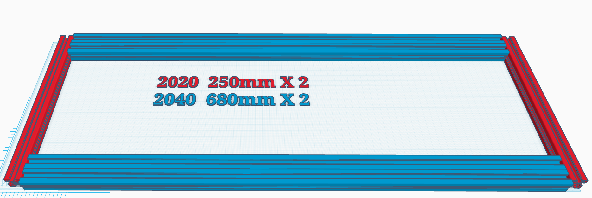
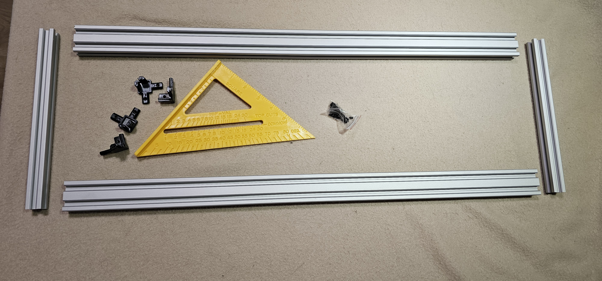

Join the profiles with the corner brackets in such a way that the solid face of the corner brackets are in line with the short profiles, note not pictured are the recommended inner corner brackets as I added them at a later stage

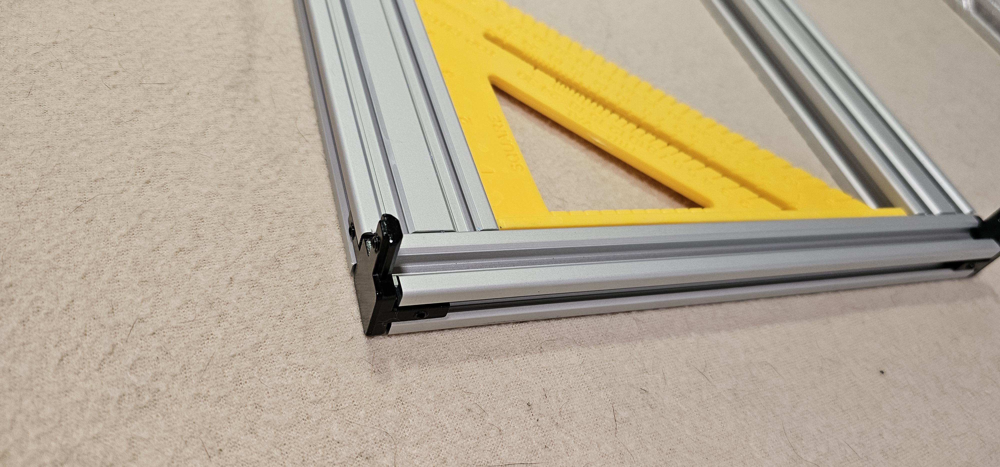

## Top

- 2X 2020 680mm profiles
- 2X 2020 250mm profiles
- 4x Corner brackets
- 4x Interior Corner Brackets (optional but recommended)

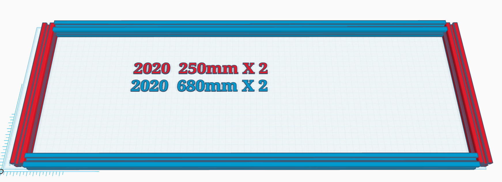
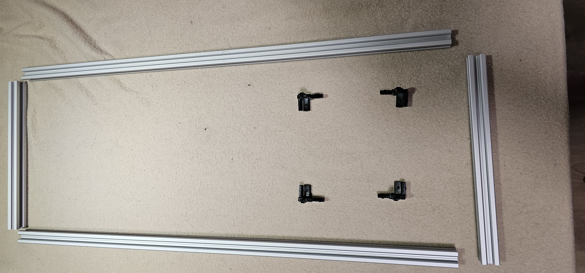

Assemble in the same way as the bottom part

## Vertical

4X 2020 500mm profiles (or 550mm)
4X MGN9H 350 or 400mm rails
4X End of travel blocks (printed) [STL](../../STL/endStop.stl)

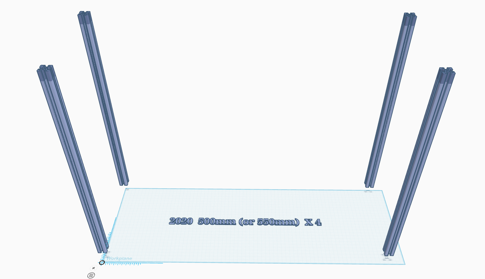

fix the vertical profiles to the bottom as pictured

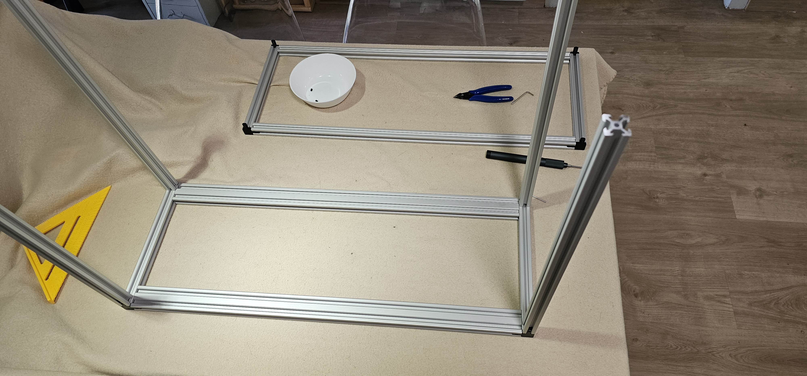

Prepare the linear rails with t-blocks (t-nut can work too but I prefer the blocks)
I used a nut every third rail hole.

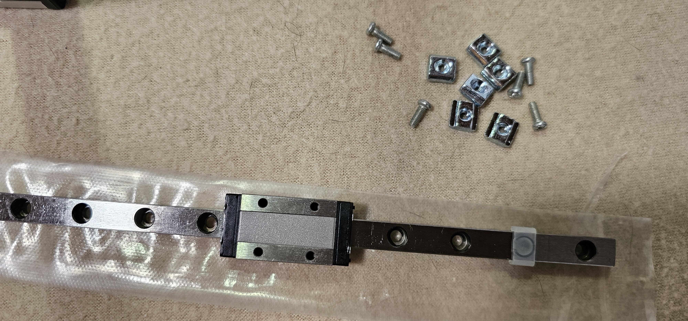

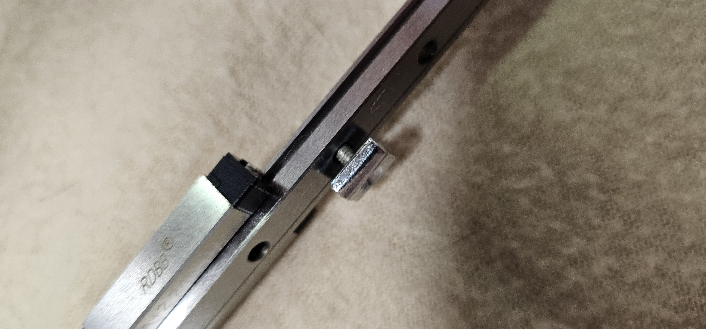

Slide the rails with nuts into the vertical profiles facing each other the long profile axis

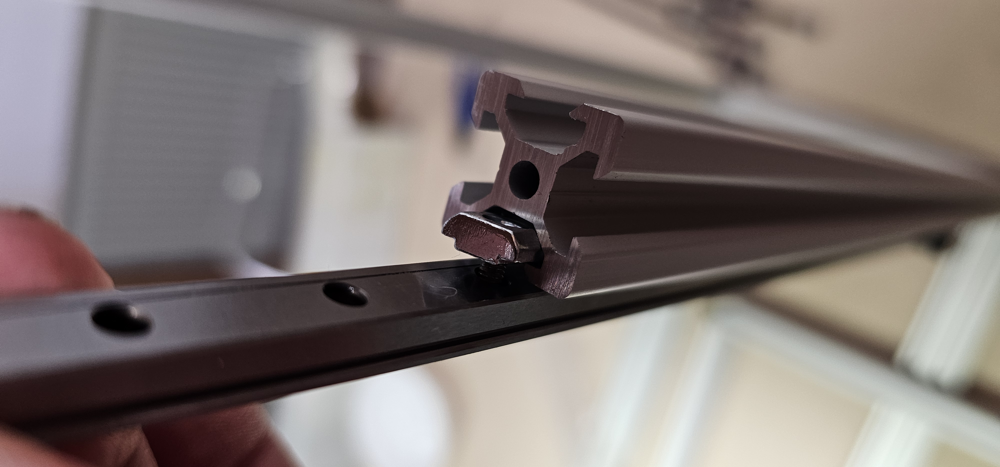

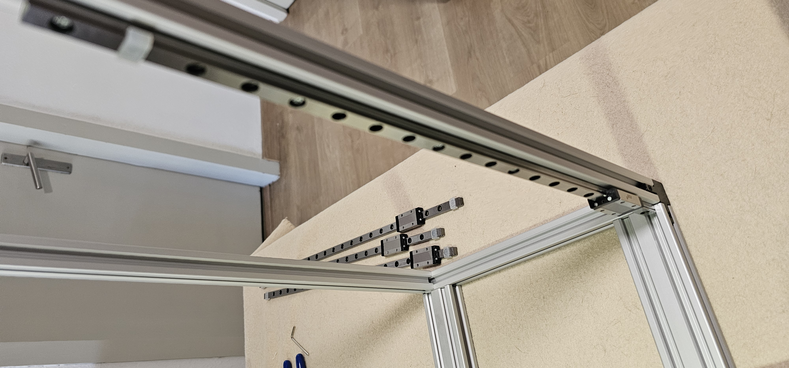

Adjust the height of the rail to start 6cm from the bottom, hint: you can use the 2060 profile to do so

Add the Z-limits so the carriages cannot fall of the rails

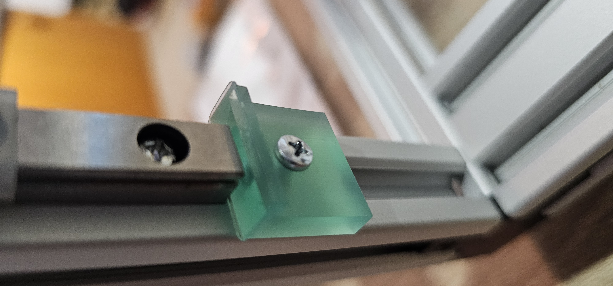

Fix the top frame to the rest of the frame

##Next : [Assembly of the bed frame](BedFrameAssembly.md)

