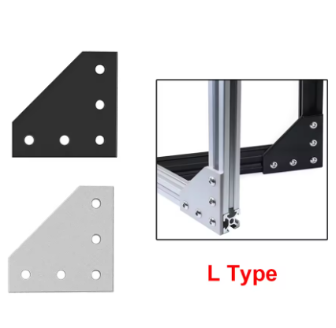
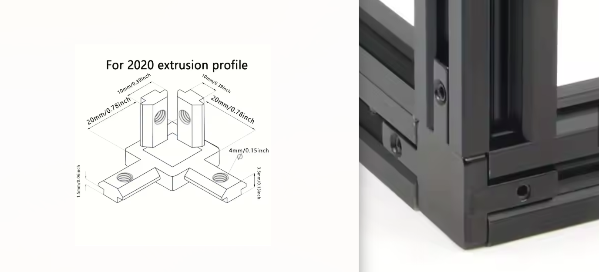
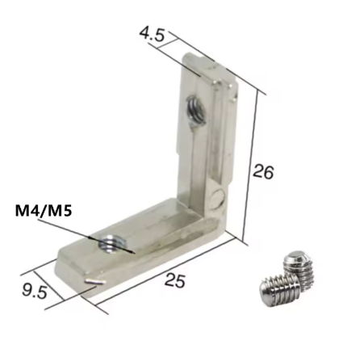
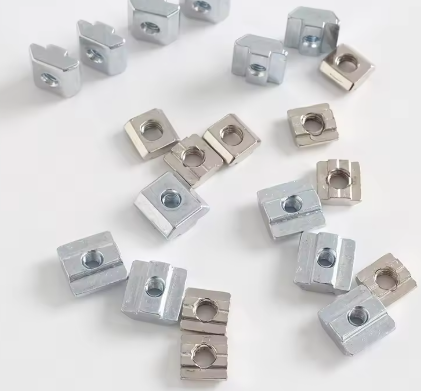

## Gantry, Printer, and Bed Frame

- 6x 2020 profile 250mm
- 2x 2040 profile 250mm
- 2x 2060 profile 250mm
- 6x 2020 profile 500mm (note: my build used 550mm as the shop made a mistake)
- 1x 2020 profile 600mm
- 2x 2020 profile 680mm
- 2x 2040 profile 680mm

## Linear Rails

- 2x MGN9H 250mm
- 4x MGN9H 400mm
- 1x MGN12H 600mm

## Additional Components

- 8x Corner L plates

- 8x Corner brackets

- 8x Interior corner brackets

- T-nuts or T-blocks (M3 for fixing the rails, M5 for everything else)

##Next : [Assembly](Assembly.md)